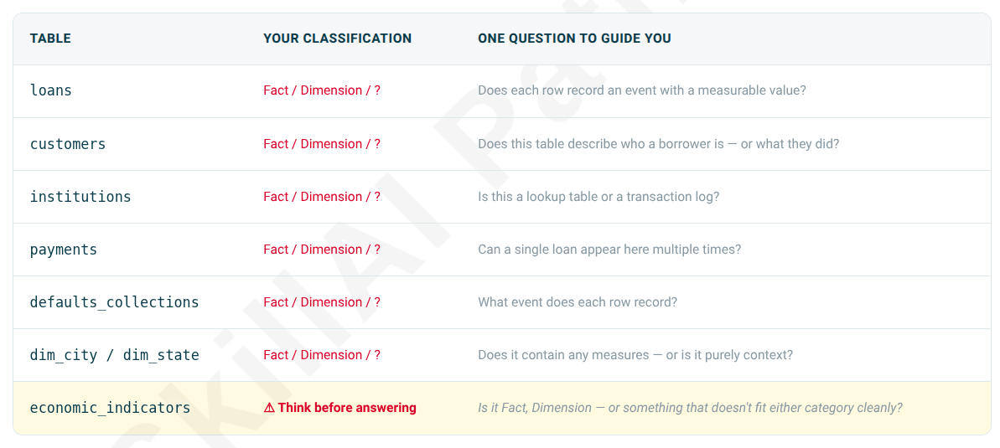

## ⚠️ Do This Before Phase 1 Opens

Every table in this dataset plays a specific role. Before you write a single JOIN — establish what each table actually is.



> [!IMPORTANT]
> **Before Phase 1:** Write down your classifications. If any table caused you to pause — that's the one to understand first. The JOIN you'll write on Tuesday depends on this answer.

---

### Table: loans

```text
+-------+-----------+--------------+-----------+-----------+-------------+------------------+----------------+-----------------+-------------+-----------+--------------------+
|loan_id|customer_id|institution_id|loan_amount|loan_status|interest_rate|loan_tenure_months|application_date|disbursement_date|maturity_date| emi_amount|     purpose_of_loan|
+-------+-----------+--------------+-----------+-----------+-------------+------------------+----------------+-----------------+-------------+-----------+--------------------+
|      1|       2440|          2954| 190607.125|  Defaulted|  11.39000034|                84|      08-12-2021|       23-12-2021|   16-11-2028|3302.540039|     Living Expenses|
|      2|       2440|          4741| 425798.375|     Active|  14.43999958|                48|      01-01-2022|       11-01-2022|   21-12-2025|11728.73047|Course Fees + Living|
|      3|       2440|           902|  318341.25|  Defaulted|  11.64999962|                96|      06-03-2023|       12-04-2023|   01-03-2031|5112.870117|Course Fees + Living|
|      4|       4195|          4724|  327505.75|     Active|  10.18999958|                48|      20-12-2024|       31-01-2025|   10-01-2029|8336.240234|Course Fees + Living|
|      5|       4195|           244|641567.8125|     Active|  11.68999958|                84|      16-11-2023|       10-12-2023|   03-11-2030|11219.62012|         Hostel Fees|
|      6|       4195|          2922|746155.9375|     Active|  9.390000343|                84|      15-10-2023|       26-10-2023|   19-09-2030|12152.69043|         Course Fees|
|      7|       4829|          3066|267158.0938|     Closed|  10.68000031|                36|      28-12-2021|       17-01-2022|   01-01-2025| 8706.19043|Course Fees + Living|
|      8|       4829|          2771| 330773.625|     Active|  11.97999954|                96|      20-01-2023|       04-03-2023|   21-01-2031| 5373.02002|         Course Fees|
|      9|       4829|          1623|427533.1563|     Active|  9.680000305|                60|      15-01-2023|       09-02-2023|   14-01-2028|9016.759766|         Course Fees|
|     10|       1858|          2657|     250770|     Active|  16.97999954|                60|      14-11-2022|       16-12-2022|   20-11-2027|6230.259766|     Living Expenses|
|     11|       1858|           777|445111.0625|     Active|  14.44999981|                84|      04-05-2024|       11-06-2024|   06-05-2031|8451.349609|Course Fees + Living|
|     12|       1858|           145|361205.2813|     Active|  14.52000046|                60|      09-10-2021|       23-10-2021|   27-09-2026|8502.269531|         Course Fees|
|     13|       1259|          2807|326221.8125|     Active|  11.65999985|                96|      12-09-2023|       20-10-2023|   08-09-2031|5242.069824|Course Fees + Living|
|     14|       1259|          3401|   360869.5|     Active|  13.35999966|                96|      10-02-2023|       15-03-2023|   01-02-2031|6137.959961|Course Fees + Living|
|     15|       1259|          1018|214440.7031|     Active|  14.42000008|                72|      08-02-2022|       04-03-2022|   01-02-2028|4467.339844|Course Fees + Living|
|     16|       2697|          4665|258446.9531|     Active|  10.57999992|                60|      25-10-2022|       06-11-2022|   11-10-2027|5564.649902|         Course Fees|
|     17|       2697|          5000|318886.0938|     Active|  9.619999886|                96|      06-11-2022|       16-12-2022|   04-11-2030|4775.109863|         Course Fees|
|     18|       2697|          4882|349092.5313|     Active|  11.72999954|                60|      25-04-2022|       02-06-2022|   07-05-2027|7717.899902|     Living Expenses|
|     19|       2093|          4227| 726665.875|     Active|  11.97999954|                48|      19-12-2024|       30-01-2025|   09-01-2029|19128.48047|     Living Expenses|
|     20|       2093|          4274|  840717.75|     Active|  11.14999962|                36|      10-05-2025|       15-06-2025|   30-05-2028|27584.01953|         Course Fees|
+-------+-----------+--------------+-----------+-----------+-------------+------------------+----------------+-----------------+-------------+-----------+--------------------+
only showing top 20 rows
```

> Classifications: **Fact table**

- Each row records a discrete event with measurable value
    - Every row represents a loan disbursement event — a specific, point-in-time transaction
    - It has measurable numerical values: `loan_amount`, `interest_rate`, `emi_amount`

- Contains foreign keys to dimensions
    - `customer_id` → links to a customers dimension
    - `institution_id` → links to an institutions dimension
    - These are dimensional references, which is the hallmark of a fact table

- Captures business metrics
    - Loan amounts, interest rates, EMI amounts — these are quantifiable measures
    - Status changes (`Active`, `Defaulted`, `Closed`) represent state transitions within the loan lifecycle

- Granularity is clear
    - One row = one loan record
    - The grain is "one loan per customer per institution per application"

> Guiding Question Answer

*Does each row record an event with a measurable value?* 

✅ YES — Each row records the creation/disbursement of a loan with measurable financial attributes (amount, rate, tenure, EMI).

> What This Means for My Analysis

- This table is our central fact table for loan portfolio analysis
- We can join this table with `customers` and `institutions` dimensions to answer questions like:
    - Which institution disburses the most loans?
    - What's the average loan amount by customer type
    - Which loans are defaulting?
- `loan_status` suggests this table may also track state changes over time (making it semi-temporal)

---

### Table: customers

```text
+-----------+--------------+------------+--------------------+-------+--------------------+-------------+-----------+-------------------+--------------------+-------------+------+--------------+
|customer_id|     full_name|phone_number|       email_address|city_id|     current_address|annual_income|cibil_score|   employemnet_type|       employer_name|date_of_birth|gender|eduction_level|
+-----------+--------------+------------+--------------------+-------+--------------------+-------------+-----------+-------------------+--------------------+-------------+------+--------------+
|          1| Dayita Bakshi|917486879361|dayita.bakshi680@...|   1002|218, Sami Zila, L...|      1156843|        832|Government Employee|  Public Sector Bank|   18-09-1995|Female|     Bachelors|
|          2|  Hardik Saini|918893807924|hardik.saini599@y...|   1010|40/26 Mall Path T...|  310385.0625|        672|   Private Employee|  Tech Solutions Ltd|   16-07-1995|  Male|       Diploma|
|          3|   Libni Bassi|918288939172|libni.bassi694@ho...|   1027|18, Pathak Road, ...|  1925882.375|        668|     Business Owner|        Own Business|   12-10-2003|Female|     Bachelors|
|          4|    Liam Setty|917068528481|liam.setty637@hot...|   1027|H.No. 53, Bora Ro...|  349506.7813|        606|      Self Employed|       Self Employed|   10-06-2003|  Male|     Bachelors|
|          5|  Omaja Bhalla|919789173738|omaja.bhalla245@o...|   1001|H.No. 64, Kakar Z...|  151329.2344|        600|            Student|      Part-time Work|   09-09-1996|Female|     Bachelors|
|          6|  Lekha Sangha|919367704310|lekha.sangha33@ya...|   1023|287 Batta Zila, J...|   616352.875|        566|      Self Employed|Independent Contr...|   09-01-1998|Female|     Bachelors|
|          7| Vivaan Wadhwa|918441540984|vivaan.wadhwa376@...|   1019|18/451, Saran Roa...|       451306|        708|     Business Owner|     Family Business|   07-07-1997|  Male|       Masters|
|          8|  Zehaan Issac|917364193040|zehaan.issac825@o...|   1028|880 Naik Surat-54...|     438643.5|        759|Government Employee|                DRDO|   09-12-1998|  Male|       Diploma|
|          9| Balveer Chada|918017672434|balveer.chada798@...|   1024|22/78, Lanka Stre...|  232829.5156|        517|      Self Employed|       Self Employed|   26-03-2005|  Male|     Bachelors|
|         10|   Darpan Kota|918978962006|darpan.kota647@ou...|   1023|H.No. 09, Karpe C...|       609964|        814|     Business Owner|     Trading Company|   28-06-2004|  Male|     Bachelors|
|         11| Jagat Mallick|917016497552|jagat.mallick444@...|   1025|29/97, Solanki Ga...|  394218.9688|        542|   Private Employee|           Accenture|   05-12-1993|  Male|     Bachelors|
|         12| Avi Chaudhari|917799142588|avi.chaudhari481@...|   1023|51/333 Sen Circle...|   417171.125|        799|Government Employee|                ISRO|   21-06-1999|  Male|       Masters|
|         13| Chandran Bedi|917813233104|chandran.bedi717@...|   1011|267, Kala Chowk A...|  393261.1563|        585|   Private Employee|             Infosys|   17-03-2000|  Male|     Bachelors|
|         14|    Udyati Sur|919751334491|udyati.sur293@yah...|   1030|H.No. 30, Bhat Ho...|  781751.0625|        682|   Private Employee|              Amazon|   06-04-2005|Female|     Bachelors|
|         15|  Yashoda Buch|917692624346|yashoda.buch67@gm...|   1026|13/61, Koshy Udup...|  790777.3125|        656|   Private Employee|             Infosys|   17-04-2004|Female|     Bachelors|
|         16|  Harsh Murthy|919896960280|harsh.murthy91@ou...|   1028|24 Mutti Chowk Ba...|   670292.625|        745|      Self Employed|Independent Contr...|   03-07-2002|  Male|       Masters|
|         17| Yashica Lanka|919063511934|yashica.lanka380@...|   1022|H.No. 354 Sarma S...|  214603.3438|        681|      Self Employed|Freelance Consultant|   20-11-2004|Female|       Masters|
|         18|Damyanti Dugal|918982729635|damyanti.dugal333...|   1013|35/34 Suresh Circ...|       613738|        681|   Private Employee|  Tech Solutions Ltd|   07-12-2001|Female|       Diploma|
|         19|   Lekha Edwin|918638346838|lekha.edwin892@ya...|   1014|01/12 Banik Circl...|   1091892.25|        764|      Self Employed|Freelance Consultant|   05-03-2000|Female|     Bachelors|
|         20|  Rachita Kade|918163464032|rachita.kade346@y...|   1006|H.No. 86, Dubey U...|      1154321|        626|   Private Employee|                 TCS|   06-11-2005|Female|     Bachelors|
+-----------+--------------+------------+--------------------+-------+--------------------+-------------+-----------+-------------------+--------------------+-------------+------+--------------+
only showing top 20 rows
```

> Classifications: **Dimension table**

- Describes WHO a borrower is — not what they did
    - Contains descriptive attributes about each customer as a person/entity
    - Examples: `full_name`, `email_address`, `phone_number`, `gender`, `education_level`, `date_of_birth`
    - These are characteristics, not transactions

- No measurable business events
    - There are no quantified metrics that represent "something that happened"
    - Even `annual_income` and `cibil_score` are properties of the customer — not measures of an action or outcome

- Low cardinality changes (slowly)
    - Customer information changes slowly (if at all)
    - This is a classic Slowly Changing Dimension (SCD) candidate
    - A customer's name, education level, or CIBIL score doesn't fluctuate daily like loan disbursements do

- Primary key with no grain
    - `customer_id` is a unique identifier, but there's only one row per customer
    - Dimension tables have one row per entity; fact tables have one row per event

- Foreign key relationship
    - Referenced BY the `loans` fact table via `customer_id`
    - This is the classic direction: dimension is looked up, not the other way around

- Contains a geographic reference
    - `city_id` is a foreign key to a `dim_city` or similar geographic dimension
    - Dimensions pointing to other dimensions is common (conformed dimensions)

> Guiding Question Answer

*Does this table describe who a borrower is — or what they did?*

✅ WHO they ARE — This is purely profile/context data about the borrower, not their actions or transactions.

> How It Relates to the loans Fact Table

```text
loans (FACT)
  ├─ customer_id → customers (DIMENSION)
  └─ institution_id → institutions (DIMENSION)
```

When analyzing your loan portfolio, you'd join `loans` to `customers` to ask questions like:

- What's the default rate by education level?
- Do self-employed customers have higher interest rates?
- Which employment types borrow the most for course fees?

*The `customers` dimension enriches your loan facts with context about who took those loans.*

---

### Table: institutions

```text
+--------------+--------------------+-------+----------------+------------------+--------------+------------------+--------------+--------------------+
|institution_id|    institution_name|city_id|institution_type|establishment_year|total_students|average_course_fee|placement_rate|accreditation_status|
+--------------+--------------------+-------+----------------+------------------+--------------+------------------+--------------+--------------------+
|             1|National Technolo...|   1025|         College|              2007|          4006|       53861.78906|   69.55000305|              NAAC A|
|             2|Central Law Unive...|   1017|      University|              1963|          3919|         313573.25|         63.25|      NBA Accredited|
|             3|State Management ...|   1024|      University|              2009|          4432|       133544.2969|   58.27000046|             NAAC B+|
|             4|Advanced Arts & S...|   1025|         College|              1971|          5607|        93312.1875|         48.25|      UGC Recognized|
|             5|Regional Law Univ...|   1030|      University|              1987|          2709|       298089.5625|   83.34999847|      NBA Accredited|
|             6|Advanced Commerce...|   1016|       Institute|              2003|          8858|       156569.9688|   75.95999908|             NAAC A+|
|             7|Indian Law Univer...|   1003|      University|              1991|          9241|        432581.375|   77.51999664|             NAAC B+|
|             8|State Engineering...|   1003|       Institute|              1994|         20435|       686259.0625|   70.31999969|              NAAC B|
|             9|Government Medica...|   1016|      University|              2018|          8662|       359438.1875|   76.69999695|             NAAC B+|
|            10|Government Manage...|   1026|      University|              1971|          4764|       217872.0625|   45.31000137|              NAAC B|
|            11|State Technology ...|   1018|      University|              2016|          6341|        366436.875|   67.20999908|      NBA Accredited|
|            12|Central Commerce ...|   1030|      University|              2016|         10353|       249906.0625|          NULL|              NAAC B|
|            13|State Medical Uni...|   1030|      University|              2015|          4487|       243562.6406|   80.70999908|      Not Accredited|
|            14|Indian Technology...|   1004|      University|              1954|         18459|         679913.25|   82.51000214|      AICTE Approved|
|            15|Premier Managemen...|   1009|         College|              1987|          3033|       141648.1563|   72.45999908|             NAAC B+|
|            16|Indian Technology...|   1007|       Institute|              1951|          5989|       393774.1563|   94.41999817|             NAAC B+|
|            17|National Law Inst...|   1028|       Institute|              1990|          2926|       237682.2656|          NULL|              NAAC B|
|            18|Indian Technology...|   1005|       Institute|              2009|         16071|          733016.5|   75.90000153|             NAAC B+|
|            19|Central Technolog...|   1021|       Institute|              1990|          2611|          177431.5|   54.95000076|      NBA Accredited|
|            20|State Law University|   1023|      University|              2017|          1889|       178993.3438|   58.77999878|      Not Accredited|
+--------------+--------------------+-------+----------------+------------------+--------------+------------------+--------------+--------------------+
only showing top 20 rows
```

> Classifications: **Dimension table**

- Describes WHAT an institution is — not transactions involving it
    - Contains descriptive attributes about each educational institution
    - Examples: `institution_name`, `institution_type`, `establishment_year`, `accreditation_status`
    - These are characteristics of the entity, not measurable events

- No quantified business events
    - While it contains numerical data (`total_students`, `average_course_fee`, `placement_rate`), these are properties of the institution — not transactions
    - These are descriptive metrics about the institution itself, not measures of something that happened

- One row per institution
    - `institution_id` uniquely identifies each institution
    - There's exactly one row per institution — classic dimension table structure
    - No repetition or grain concept like in fact tables

- Slowly changing data
    - Institution information rarely changes (`accreditation_status` might be the fastest-changing attribute)
    - `placement_rate` and `average_course_fee` might update annually or less often
    - This is a Slowly Changing Dimension (SCD) candidate

- Primary key with foreign key to geography
    - `city_id` references a geographic dimension (similar to `customers` → `city_id`)
    - Dimensions pointing to other dimensions (conformed dimensions) is standard

- Referenced BY fact tables, not the source of facts
    - The `loans` table joins to this table via `institution_id`
    - Institutions don't record events; they're lookup context for loan disbursement facts

> Guiding Question Answer

*Is this a lookup table or a transaction log?*

✅ LOOKUP TABLE — This is purely reference/context data about which educational institutions exist and their characteristics.

> How It Relates to Our Data Model

```text
loans (FACT)
  ├─ customer_id → customers (DIMENSION)
  └─ institution_id → institutions (DIMENSION)

institutions (DIMENSION)
  └─ city_id → dim_city (DIMENSION)
```

When analyzing our loan portfolio, we'd join `loans` to `institutions` to answer questions like:

- Which institution types have the highest default rates?
- Do universities vs. colleges have different average loan amounts?
- What's the correlation between placement rate and loan repayment?
- How does average course fee by institution affect EMI amounts?

*The institutions dimension provides context about where the education is happening, enriching your loan facts with institutional characteristics.*

---

### Table: payments

```text
+----------+-------+------------+--------------+--------------+--------------+-----------+-------------------+------------------+-------------------+
|payment_id|loan_id|payment_date|payment_amount|payment_method|payment_status|   late_fee|principal_component|interest_component|outstanding_balance|
+----------+-------+------------+--------------+--------------+--------------+-----------+-------------------+------------------+-------------------+
|         1|   4659|  31-03-2023|   3043.120117|    Debit Card|       Success|          0|        1500.170044|       1542.939941|        163080.3594|
|         2|   4659|  02-05-2023|   2082.570068|           UPI|        Failed|          0|                  0|                 0|        163080.3594|
|         3|   4659|  06-06-2023|   2960.300049|          RTGS|       Success|          0|        1431.420044|       1528.880005|        161648.9375|
|         4|   4659|  03-07-2023|   3006.419922|   Net Banking|       Success|          0|        1490.959961|       1515.459961|        160157.9844|
|         5|   4659|  04-08-2023|   3023.929932|           UPI|       Success|          0|        1522.449951|        1501.47998|        158635.5156|
|         6|   4659|  04-09-2023|   3111.120117|   Net Banking|       Success|          0|        1623.910034|       1487.209961|        157011.6094|
|         7|   4659|  02-10-2023|    3243.77002|   Net Banking|        Failed|          0|                  0|                 0|        157011.6094|
|         8|   4659|  29-10-2023|   3298.610107|   Credit Card|       Success|          0|        1826.630005|        1471.97998|        155184.9844|
|         9|   4659|  28-11-2023|   2957.709961|   Net Banking|       Success|          0|        1502.849976|       1454.859985|        153682.1406|
|        10|   4659|  29-12-2023|   2468.360107|        Cheque|       Success|          0|        1027.589966|        1440.77002|        152654.5469|
|        11|   4659|  25-01-2024|    3328.97998|           UPI|       Success|          0|        1897.839966|       1431.140015|        150756.7031|
|        12|   4659|  02-03-2024|   3069.870117|           UPI|       Success|          0|         1656.52002|       1413.339966|        149100.1875|
|        13|   4659|  24-03-2024|   3015.540039|           UPI|       Success|          0|         1617.72998|       1397.810059|        147482.4531|
|        14|   4659|  29-04-2024|   1791.130005|   Net Banking|       Success|          0|         408.480011|       1382.650024|        147073.9688|
|        15|   4659|  31-05-2024|   3261.429932|   Net Banking|       Success|371.4100037|        1882.609985|       1378.819946|        145191.3594|
|        16|   4659|  24-06-2024|   3216.780029|           UPI|       Success|          0|        1855.609985|       1361.170044|          143335.75|
|        17|   4659|  31-07-2024|   3171.719971|          NEFT|       Success|          0|        1827.939941|        1343.77002|        141507.8125|
|        18|   4659|  21-08-2024|   3312.080078|   Net Banking|       Success|          0|        1985.439941|       1326.640015|         139522.375|
|        19|   4659|  29-09-2024|    2960.51001|           UPI|       Success|          0|         1652.48999|        1308.02002|         137869.875|
|        20|   4659|  24-10-2024|   3305.389893|   Net Banking|       Success|          0|        2012.859985|       1292.530029|        135857.0156|
+----------+-------+------------+--------------+--------------+--------------+-----------+-------------------+------------------+-------------------+
only showing top 20 rows
```

> Classifications: **Fact table**

- Each row records a discrete event with measurable value
    - Every row represents a payment transaction — a specific action that occurred on a specific date
    - It has measurable numerical values: `payment_amount`, `principal_component`, `interest_component`,` outstanding_balance`, `late_fee`
    - Each payment is a distinct, quantifiable business event

- Contains a foreign key to a fact table dimension
    - `loan_id` links back to the `loans` fact table
    - This is a transactional detail table — a "child fact table" that breaks down a parent fact (the loan) into smaller constituent events (payments)
    - This is a common pattern: one loan → multiple payments

- High cardinality — one loan appears multiple times
    - Look at the sample data: `loan_id` 4659 appears 20 times (rows 1-20)
    - A single loan generates many payment records over its lifetime
    - This is the defining characteristic of a fact table (vs. a dimension)

- Captures business metrics and state changes
    - Payment amounts, method, status (Success/Failed), principal/interest split
    - Tracks the progression of loan repayment over time
    - `outstanding_balance` shows how the loan is being paid down transaction-by-transaction

- Temporal granularity is precise
    - One row = one payment event at a specific date
    - Clear timestamp (`payment_date`) marking when the event occurred
    - Perfect for time-series analysis

- Additivity and aggregation
    - You can sum `payment_amount`, `principal_component`, `interest_component` across multiple rows
    - These are classic additive fact measures

> Guiding Question Answer

*Can a single loan appear here multiple times?*

✅ YES — MANY times — One loan generates multiple payment records over its tenure. This is the smoking gun that identifies a fact table.

> Relationship to loans (Parent Fact Table)

```text
loans (PARENT FACT)
  └─ loan_id → payments (CHILD/DETAIL FACT)
```

This is a hierarchical fact table structure:

- `loans` = Loan-level facts (one row per loan disbursement)
- `payments` = Payment-level facts (multiple rows per loan showing repayment progress)

> Analysis Implications

You'd use `payments` to answer granular questions like:

- How many payment failures occur by payment method?
- What's the trend in outstanding balance for defaulted loans?
- Which loans have late fees, and how much?

When you join `payments` → `loans` → `customers`, you can ask:

- Do private employees make more on-time payments than self-employed borrowers?
- Which institutions' students have higher payment default rates?

--- 

### Table: defaults_collections

```text
+----------+-----------+-------+------------+--------------+------------+-----------------+-----------------+----------------+-----------------+---------------+-------------------+
|default_id|customer_id|loan_id|default_date|default_amount|days_overdue|collection_status|last_contact_date|contact_attampts|legal_notice_sent|recovery_amount|collection_agent_id|
+----------+-----------+-------+------------+--------------+------------+-----------------+-----------------+----------------+-----------------+---------------+-------------------+
|         1|       2440|      1|  11-02-2024|   147013.5938|         528|     Legal Action|       21-06-2025|              34|                1|    69137.67188|                  2|
|         2|       2440|      3|  06-05-2024|   281528.5938|         443|     Legal Action|       05-05-2025|              20|                1|    153692.8438|                  8|
|         3|       2200|     28|  27-11-2023|    639976.625|         604|      Written Off|       01-07-2025|              64|                1|    207236.1875|                  2|
|         4|       2487|     37|  23-12-2024|   250034.4844|         212|     Legal Action|       14-06-2025|              46|                1|     178217.875|                  1|
|         5|       2487|     38|  16-07-2022|   240916.4531|        1103|      Written Off|       07-07-2025|              64|                1|    81229.64844|                  7|
|         6|       4401|     52|  13-04-2025|     413609.75|         101|     Legal Action|       02-05-2025|              46|                1|    82103.52344|                  8|
|         7|       4080|     60|  27-03-2025|   301048.5625|         118|           Active|       01-07-2025|              30|                0|    86490.82031|                  8|
|         8|        303|     66|  06-03-2025|   174658.1719|         139|     Legal Action|       12-07-2025|              19|                1|    88702.60938|                  4|
|         9|       1955|     71|  14-07-2025|        377657|          30|           Active|       12-07-2025|               6|                0|     5071.77002|                 10|
|        10|        269|     75|  12-06-2023|   352935.3438|         772|      Written Off|       26-06-2025|              42|                1|    16164.04004|                  9|
|        11|       4535|     77|  12-12-2024|   313139.7188|         223|          Settled|       16-05-2025|              10|                1|     239058.875|                  6|
|        12|       3818|     80|  19-07-2025|   326476.2813|          30|     Legal Action|       03-07-2025|              21|                1|      168087.25|                  6|
|        13|       3818|     81|  08-07-2025|      674055.5|          30|           Active|       05-07-2025|              19|                0|     287275.875|                  9|
|        14|       1047|     85|  02-06-2025|   635693.0625|          51|           Active|       20-06-2025|              23|                0|    185782.1563|                  8|
|        15|       1047|     86|  23-03-2024|   298883.2813|         487|     Legal Action|       15-07-2025|              21|                1|    175856.4531|                  3|
|        16|       1047|     87|  14-09-2024|   348488.9375|         312|           Active|       30-06-2025|               5|                0|    128092.4766|                  6|
|        17|       2511|     92|  05-09-2024|   138578.2969|         321|           Active|       05-05-2025|               7|                1|     3871.77002|                  1|
|        18|       1353|     94|  22-07-2025|   838776.4375|          30|           Active|       09-07-2025|              26|                1|    151214.4688|                  7|
|        19|       3489|    106|  24-05-2025|   156812.0469|          60|           Active|       19-07-2025|              20|                0|    40831.21875|                  5|
|        20|        165|    120|  21-08-2024|   843520.0625|         336|     Legal Action|       21-05-2025|              18|                1|    494582.6563|                  6|
+----------+-----------+-------+------------+--------------+------------+-----------------+-----------------+----------------+-----------------+---------------+-------------------+
only showing top 20 rows
```

> Classifications: **Fact table**

- Each row records a discrete event with measurable value
    - Every row represents a default event — a specific borrower's loan entering default status on a specific date
    - It has measurable numerical values: `default_amount`, `days_overdue`, `recovery_amount`, `contact_attampts`
    - Each default is a distinct, quantifiable business event tied to a point in time

- Contains foreign keys to dimensions
    - `customer_id` → links to `customers` dimension
    - `loan_id` → links to `loans` dimension (which itself is a fact table)
    - `collection_agent_id` → links to a `collection_agents` dimension (implied)
    - These dimensional references are hallmarks of a fact table

- High cardinality — one loan can appear multiple times
    - While each loan typically defaults once, one customer can have multiple defaults (see `customer_id` 1047 and 2487 in the sample)
    - A single loan can exist in multiple states: disbursed, active, defaulted, collected, written off
    - This is a state-transition fact table tracking the lifecycle of problem loans

- Captures business metrics and operational tracking
    - `default_amount`, `days_overdue`, `recovery_amount` = financial measures
    - `contact_attampts`, `legal_notice_sent` = operational counts
    - `collection_status` (Legal Action, Written Off, Settled, Active) = categorical state tracking
    - These track the collection process — the actions taken in response to default

- Temporal granularity is precise
    - One row = one default event with specific `default_date` and `last_contact_date`
    - Timestamps mark when key events occur in the collections lifecycle
    - Perfect for analyzing default trends and collection performance over time

- Additivity and aggregation
    - You can sum `default_amount`, `recovery_amount`, `contact_attampts` across rows
    - These are additive fact measures suitable for aggregation and analysis

> Guiding Question Answer

*What event does each row record?* 

✅ DEFAULT EVENT — Each row records when a loan entered default status, along with all subsequent collection activities and recovery attempts for that default.

> Relationship to Other Tables

```text
loans (PARENT FACT)
  ├─ loan_id → payments (DETAIL FACT - normal repayment)
  └─ loan_id → defaults_collections (DETAIL FACT - problem loans)

customers (DIMENSION)
  ├─ customer_id → loans (FACT)
  └─ customer_id → defaults_collections (FACT)
```

This is a problem-loan detail fact table:

- `loans` = Loan origination facts
- `payments` = Successful repayment progression
- `defaults_collections` = Failed repayment & recovery efforts

> Key Insight: This is a State-Tracking Fact Table

Unlike `payments` (which records every single transaction), `defaults_collections` records:

- One row per default event (when a loan first defaults)
- Continuously updated fields like `collection_status`, `recovery_amount`, `last_contact_date`, `contact_attampts`
- This makes it a Slowly Changing Dimension-like fact table — it's a fact table that evolves over time rather than generating new transactions

> Analysis Implications

We'd use `defaults_collections` to answer questions like:

- What's the total recovery amount by collection status?
- How many contact attempts does it take to settle a default?
- Which collection agents have the highest recovery rates?
- What's the average days_overdue before legal action is taken?
- How many defaults result in written-off loans vs. settlements?

When we join `defaults_collections` → `loans` → `customers`, we can ask:

- Do customers with higher CIBIL scores have faster recovery times?
- Which institutions' students have the highest default rates?
- Does employment type correlate with collection_status outcomes?

---

### Tables: dim_city/dim_state

> dim_city

```text
+-------+-----------+--------+-------------------+
|city_id|  city_name|state_id|tier_classification|
+-------+-----------+--------+-------------------+
|   1001|  Ahmedabad|       8|              Tier1|
|   1002|  Bangalore|      13|              Tier1|
|   1003|     Bhopal|      15|              Tier2|
|   1004|Bhubaneswar|      21|              Tier3|
|   1005| Chandigarh|      22|              Tier2|
|   1006|    Chennai|      25|              Tier1|
|   1007| Coimbatore|      25|              Tier2|
|   1008|   Dehradun|      29|              Tier3|
|   1009|      Delhi|       6|              Tier1|
|   1010|    Gangtok|      24|              Tier3|
+-------+-----------+--------+-------------------+
only showing top 10 rows
```

> dim_state

```text
+--------+-----------------+---------+
|state_id|       state_name|   region|
+--------+-----------------+---------+
|       1|   Andhra Pradesh|    South|
|       2|Arunachal Pradesh|Northeast|
|       3|            Assam|Northeast|
|       4|            Bihar|     East|
|       5|     Chhattisgarh|  Central|
|       6|            Delhi|    North|
|       7|              Goa|     West|
|       8|          Gujarat|     West|
|       9|          Haryana|    North|
|      10| Himachal Pradesh|    North|
+--------+-----------------+---------+
only showing top 10 rows
```

> Classifications: **Dimension table**

- Pure descriptive context — zero business events
    - `dim_city` describes WHERE cities are and how they're classified
    - `dim_state` describes states and their geographic regions
    - Neither table contains any measures, transactions, or quantifiable business activity
    - These are lookup tables, not event records

- No measurable metrics
    - `tier_classification` is a categorical attribute (Tier1, Tier2, Tier3) — a label, not a measure
    - `region` is a categorical attribute (South, Northeast, North, etc.) — a label, not a measure
    - Compare to fact tables which have numeric measures like amounts, counts, rates

- One row per entity (low cardinality)
    - `dim_city`: One row per city (identified by city_id)
    - `dim_state`: One row per state (identified by state_id)
    - Fact tables have many rows per dimensional entity; these have exactly one

- Slowly changing or static data
    - City names and state classifications rarely change
    - These are Type 1 Slowly Changing Dimensions (SCD) — stable reference data
    - Minimal updates needed (maybe tier reclassification every few years)

- Referenced BY other tables, never the referrer
    - `dim_state` is looked up BY `dim_city` (via `state_id`)
    - `dim_city` is looked up BY `customers` (via `city_id`)
    - `dim_city` is looked up BY `institutions` (via `city_id`)
    - This is the classic dimension pattern: other tables point TO dimensions

- Conformed dimension relationship
    - `dim_state` feeds INTO `dim_city` (dimensional hierarchy)
    - Both are conformed dimensions — used consistently across the data warehouse
    - This is standard practice for geographic dimensions (city → state → region)

> Guiding Question Answer

*Does it contain any measures — or is it purely context?*

✅ PURELY CONTEXT — Zero numeric measures. 100% descriptive, categorical attributes.

> The Geographic Dimension Hierarchy

```text
dim_state (Region → State)
    ↑
    |
    | state_id
    |
dim_city (City → Tier)
    ↑
    | city_id
    |
Referenced BY: customers, institutions
```

This is a star schema pattern with a hierarchical dimension:

- Region (coarsest) → State → City (finest) = geographic roll-up levels
- Tier classification adds operational categorization (Tier1/2/3 cities)

> How They Connect to Facts

```text
loans (FACT)
  ├─ customer_id → customers (DIMENSION)
  │                    └─ city_id → dim_city (GEOGRAPHIC DIMENSION)
  │                                     └─ state_id → dim_state (GEOGRAPHIC DIMENSION)
  │
  └─ institution_id → institutions (DIMENSION)
                          └─ city_id → dim_city (GEOGRAPHIC DIMENSION)
                                           └─ state_id → dim_state (GEOGRAPHIC DIMENSION)
```

> Analysis Implications

We'd use these geographic dimensions to ask questions like:

- What's the default rate by city tier (Tier1 vs Tier2 vs Tier3)?
- Which states have the highest loan disbursement volumes?
- Do Tier1 cities have higher CIBIL scores on average?
- How does region (North/South/East/West) affect interest rates?
- Which region has the fastest payment recovery from defaults?

When you join `loans` → `customers` → `dim_city` → `dim_state`, you can segment analysis by:

- Geographic location (city, state, region, tier)
- Regional economic patterns (e.g., "Is South region riskier than North?")
- Urban vs. Tier classification impact on loan performance

> [!NOTE]
> These are contextual lookup tables that sit at the end of the dimensional hierarchy. They answer "WHERE" questions but never contain the "HOW MUCH" or "HOW MANY" measures that characterize fact tables.

---

### Table: economic_indicators

```text
+------------+--------+-------+---------------+--------------+------------------+--------------------------+-----------------+-------------+
|indicator_id|state_id|quarter|gdp_growth_rate|inflation_rate|unemployement_rate|education_spending_percent|per_capita_income|literacy_rate|
+------------+--------+-------+---------------+--------------+------------------+--------------------------+-----------------+-------------+
|           1|       1|2019-Q1|    6.349999905|   5.960000038|       3.730000019|               4.559999943|        257049.25|  82.61000061|
|           2|       1|2019-Q2|     7.78000021|   5.269999981|       2.029999971|               4.070000172|      299902.9063|  92.44999695|
|           3|       1|2019-Q3|    8.859999657|    3.24000001|       4.239999771|               5.510000229|      223211.5469|  93.59999847|
|           4|       1|2019-Q4|     8.56000042|   5.119999886|       2.549999952|               5.329999924|       283828.375|  91.47000122|
|           5|       1|2020-Q1|    3.769999981|   4.079999924|       6.309999943|               6.360000134|      276290.2813|  82.55999756|
|           6|       1|2020-Q2|    5.309999943|   5.199999809|       5.820000172|               5.889999866|      390389.0625|  89.29000092|
|           7|       1|2020-Q3|    4.639999866|   5.449999809|       4.070000172|               6.980000019|        274564.75|  86.36000061|
|           8|       1|2020-Q4|    5.369999886|   4.960000038|       6.739999771|               6.980000019|       305174.625|  80.91000366|
|           9|       1|2021-Q1|    4.849999905|    4.03000021|       3.539999962|               4.619999886|      376284.7813|  85.06999969|
|          10|       1|2021-Q2|    6.909999847|   3.089999914|       2.589999914|                6.96999979|       326199.625|  81.90000153|
+------------+--------+-------+---------------+--------------+------------------+--------------------------+-----------------+-------------+
only showing top 10 rows
```

> Classifications: **Fact table** ⚠️ but with important warnings

**Why It's Technically a Fact Table**

- Each row represents a measurable business event — with a temporal dimension
    - Every row captures economic metrics for a specific `state_id` in a specific quarter
    - The grain is clear: one row per state per quarter
    - It has measurable numeric values: `gdp_growth_rate`, `inflation_rate`, `unemployment_rate`, `education_spending_percent`, `per_capita_income`, `literacy_rate`

- Contains foreign keys to dimensions
    - `state_id` links to dim_state (dimensional reference)
    - `quarter` is a temporal dimension (2019-Q1, 2020-Q2, etc.)
    - This is the foreign key pattern typical of fact tables

- Additive and aggregable measures
    - You can sum `gdp_growth_rate` across states or quarters
    - You can average `inflation_rate`, `unemployment_rate` across periods
    - These are numeric fact measures

- High cardinality — multiple rows per state
    - State 1 (Andhra Pradesh) appears 10 times in the sample (2019-Q1 through 2021-Q2)
    - Every state will have multiple quarterly records
    - This matches the fact table pattern

**Why It's NOT a Traditional Transactional Fact Table**

⚠️ This is a PERIODIC SNAPSHOT fact table, not an event-driven fact table:

- No discrete business transaction
    - These aren't events that "happened" in the loan business
    - They're external economic observations captured at fixed intervals (quarterly)
    - No one "caused" these metrics — they're macro-economic observations

- Denormalized, derived data
    - These metrics are likely aggregated from external sources (government statistics, economic databases)
    - They're not native to the loan portfolio system
    - They're enrichment data brought in to contextualize loan performance

- Slowly changing, not transactional
    - Economic indicators don't change daily or even monthly
    - They're updated quarterly and then frozen for analysis
    - This is more like a slowly changing dimension that gets refreshed periodically

- Used for context, not core business tracking
    - The loan business doesn't directly generate these metrics
    - They're external reference data used to explain or correlate with loan behavior
    - ("Did defaults spike when unemployment rose?" type questions)

> Guiding Question Answer

*Is it Fact, Dimension — or something that doesn't fit either category cleanly?*

✅ SOMETHING BETWEEN — It's a Periodic Snapshot Fact Table (technically a fact table) but behaves more like enrichment/context data (more like a dimension in practice).

> How to Think About It

```text
CLASSIFICATION SPECTRUM:

Pure Dimensions     →     Periodic Snapshot     →     Event-Driven Facts
(static lookup)          (economic_indicators)      (loans, payments)
                              (hybrid)
```

- Like a Dimension: Slowly changing, enrichment context, external reference
- Like a Fact: Numeric measures, time-keyed (quarterly), aggregable, joinable to other tables

> Relationship to Core Fact Tables

```text
loans (EVENT FACT)
  └─ customer_id → customers (DIMENSION)
                        └─ city_id → dim_city → state_id → dim_state
                                                                      ↑
                                                                      | state_id
                                                                      |
                                                    economic_indicators (SNAPSHOT FACT)
```

The join path:

- Start with `loans` (when/where did the loan happen?)
- Join to `customers` (who took it?)
- Jon to `dim_city`/`dim_city` (what state are they in?)
- Optionally join to `economic_indicators` (what was the economic context at that time?)

> Analysis Implications

You'd use `economic_indicators` to answer contextual questions like:

- Did loan defaults increase when unemployment rose in a state?
- Do states with higher education spending have lower default rates?
- How does per capita income correlate with loan amounts by state?
- Did GDP growth slowdown in Q2 2020 (COVID) impact payment success rates?

> [!NOTE]
> Key Pattern: This table is used for correlation analysis and contextual segmentation, not for core transaction tracking.

> [!IMPORTANT]
> ⚠️ Warning: When you join `loans` → `dim_state` → `economic_indicators`, you're joining: Loan-level data (one row per loan) & State-Quarterly data (one row per state per quarter). Meaning multiple loans map to the same economic_indicators row. This is intentional — you're enriching loan facts with macro-economic context. Just be aware of the many-to-one relationship.